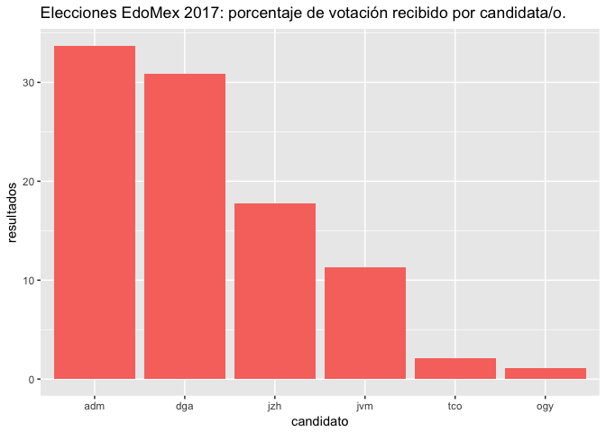

Entre ayer y hoy he encontrado varios tuits, mensajes, y videos de gente
que sostiene que si copia y pega de la página de intenet del PREP a
Excel los resultados electorales, "se ajustan los datos" mostrando que
hay un "fraude" que le quita la victoria a Delfina Gómez y se la de a
Alfredo Del Mazo. No sé cuál vaya a ser el resultado de la elección una
vez que se hagan los computos distritales. Lo que sí se, es que copiar y
pegar de una página de internet a Excel es una mala idea si uno quiere
hacer cálculos a partir de datos estadísticos. Javier Aparicio muy
brevemente ya explicó el problema
<a href = "https://javieraparicio.net/2017/06/06/prep-edomex-2017/">acá</a>.

Aunado a los problemas que señala Aparicio, por muchas razones yo no uso
Excel, y prefiero usar el programa de manejo de bases de datos "R". Una
de las virtudes de este programa es que el código con el se mueven y
modifican los datos se puede hacer público y cualquiera puede
replicarlo. Es decir, la lectura, agregación y manipulación de los datos
deja rastro. Para ilustrar esta ventaja de "R" sobre Excel, pero sobre
todo para mostrar que no hay nada raro en términos de que aparezcan y
desaparezcan votos entre la página de internet del PREP y la base de
datos, pongo aquí el código con el que llegué al mismo resultado final
que el PREP así como una gráfica para ilustarlos.

    suppressPackageStartupMessages(library(readr))
    suppressPackageStartupMessages(library(dplyr))
    suppressPackageStartupMessages(library(ggplot2))
    suppressPackageStartupMessages(library(tidyr))

    ## abrir base de datos del prep, definir tipo de columnas
    prep_edomex <- read_csv("MEX_GOB_2017/MEX_GOB_2017.csv", skip = 6, col_types = "iciciiciiiiiiiiiiiiiiiiiiiiiiiiiiiiiiiiccDDD")

    ## la base de datos trae columnas que identifican las casillas, y los resultados por partidos o coalición. 
    ## selecciono identificadores de casillas, resultados por partido o calición
    ##también selecciono el total de votos por casilla y el total de personas en la lista nominal
    prep_relevante <- prep_edomex %>% 
      select(seccion,id_casilla, tipo_casilla,
             pan, pri, prd, pt, pvem, na, morena, pes, # para seleccionar coaliciones selecciono todo o que empieza que "c"
             starts_with("c"),  -contabilizada, total_votos, lista_nominal) %>%  #y quito la columna "contabilizada"
      group_by(seccion) %>% #agrupo los resultados por sección electoral
      summarise_at(vars(pri, pvem, na, pes, pan, prd, pt,  morena, starts_with("c"), total_votos, lista_nominal), sum, na.rm = TRUE) %>% #sumo los resultads de casillas por seccion
      mutate(adm = rowSums(.[,c(2:5, 10:20)], na.rm = TRUE)) %>% # sumo los votos por partidos en coalición y por coalición de Del Mazo
      select(seccion, jvm = pan, adm,  jzh = prd, ogy = pt, dga = morena, tco = cand_ind_1, total_votos, lista_nominal) # cambio nombres a iniciales de candidatos

    ## modificar el marco para hacer operaciones más rápido
    resultados <- prep_relevante %>% 
      gather(candidato, votos, jvm:tco) %>% # paso el marco de horizontal a vertical
      group_by(candidato) %>% 
      summarise(votos = sum(votos), total_votos = sum(total_votos)) %>% 
      mutate(resultados = votos/total_votos*100) %>% # calcular porcentaje de votos
      arrange(desc(resultados)) %>% 
      mutate(candidato = factor(candidato, candidato))

    knitr::kable(resultados)

<table>
<thead>
<tr class="header">
<th align="left">candidato</th>
<th align="right">votos</th>
<th align="right">total_votos</th>
<th align="right">resultados</th>
</tr>
</thead>
<tbody>
<tr class="odd">
<td align="left">adm</td>
<td align="right">1955347</td>
<td align="right">5798557</td>
<td align="right">33.721269</td>
</tr>
<tr class="even">
<td align="left">dga</td>
<td align="right">1786962</td>
<td align="right">5798557</td>
<td align="right">30.817357</td>
</tr>
<tr class="odd">
<td align="left">jzh</td>
<td align="right">1031791</td>
<td align="right">5798557</td>
<td align="right">17.793927</td>
</tr>
<tr class="even">
<td align="left">jvm</td>
<td align="right">654681</td>
<td align="right">5798557</td>
<td align="right">11.290412</td>
</tr>
<tr class="odd">
<td align="left">tco</td>
<td align="right">123324</td>
<td align="right">5798557</td>
<td align="right">2.126805</td>
</tr>
<tr class="even">
<td align="left">ogy</td>
<td align="right">62643</td>
<td align="right">5798557</td>
<td align="right">1.080321</td>
</tr>
</tbody>
</table>

    ##gráfica con los resultados electorales
    ggplot(resultados, aes(candidato, resultados)) + geom_bar(stat = "identity", fill = "#F8766D") +
      ggtitle("Elecciones EdoMex 2017: porcentaje de votación recibido por candidata/o.")

